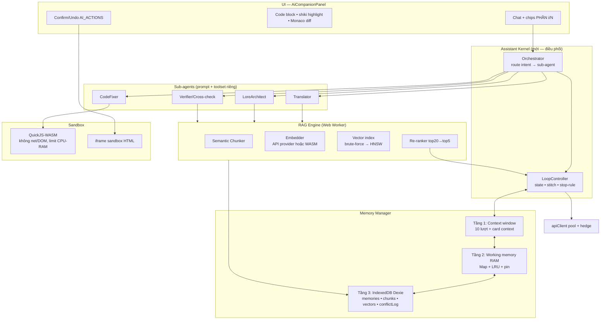

# ROADMAP NÂNG CẤP TOÀN DIỆN TRỢ LÝ AI — Dịch Card

> Phiên bản 1.0 · 2026-07-15 · Trạng thái: ĐỀ XUẤT (chưa triển khai)
> Phạm vi: `src/components/AiCompanionPanel.tsx` + hạ tầng dùng chung (`src/utils/*`)

## Mục lục

- [0. Ràng buộc nền tảng & hiện trạng](#0-ràng-buộc-nền-tảng--hiện-trạng)
- [1. Sơ đồ kiến trúc tổng thể](#1-sơ-đồ-kiến-trúc-tổng-thể)
- [2. Năng lực 1 — Hệ thống trí nhớ (Memory System)](#2-năng-lực-1--hệ-thống-trí-nhớ-memory-system)
- [3. Năng lực 2 — Cache RAM & đồng bộ](#3-năng-lực-2--cache-ram--đồng-bộ)
- [4. Năng lực 3 — Vòng lặp sinh phản hồi (Generation Loop)](#4-năng-lực-3--vòng-lặp-sinh-phản-hồi-generation-loop)
- [5. Năng lực 4 — RAG & Vector Store](#5-năng-lực-4--rag--vector-store)
- [6. Năng lực 5 — Hiểu & xử lý code](#6-năng-lực-5--hiểu--xử-lý-code)
- [7. Năng lực 6 — Sub-agent & Script sandbox](#7-năng-lực-6--sub-agent--script-sandbox)
- [8. Lộ trình triển khai theo giai đoạn](#8-lộ-trình-triển-khai-theo-giai-đoạn)
- [9. Bảng rủi ro & giảm thiểu](#9-bảng-rủi-ro--giảm-thiểu)
- [10. KPI & cách đo](#10-kpi--cách-đo)
- [11. Phụ lục — bảng quyết định công nghệ](#11-phụ-lục--bảng-quyết-định-công-nghệ)

---

## 0. Ràng buộc nền tảng & hiện trạng

**Ràng buộc quyết định mọi lựa chọn công nghệ:** app chạy **100% trong trình duyệt** (React + Vite, không có backend riêng — mọi call LLM đi qua `/api-proxy` của Vite dev server). Vì vậy:

- ❌ Không dùng được Qdrant / Milvus / pgvector / Redis (cần server).
- ✅ Kho bền vững = **IndexedDB** (quota hàng GB) thay cho localStorage (5MB, `safeSetItem` đang phải nuốt lỗi tràn).
- ✅ Tính toán nặng (embedding, index, parse) đẩy vào **Web Worker / WASM** để không đơ UI.
- ✅ Embedding có 2 đường: **API provider** (qua pool key sẵn có) hoặc **WASM local** (offline).

**Đã có sẵn (tái dùng, KHÔNG viết lại):**

| Mảnh | Ở đâu | Vai trò trong roadmap |
|---|---|---|
| Chat history 10 lượt + persist localStorage | `AiCompanionPanel.tsx` (`ai_assistant_messages`) | Trí nhớ ngắn hạn tầng 1 |
| Chia file lớn thành PHẦN i/N, bảo toàn 100% | `utils/attachmentParts.ts` (v1.99.17) | Nguồn nạp cho chunker |
| Continuation loop (max 5) + `isResponseTruncated` | `AiCompanionPanel.tsx` `handleSend` | Nền của Generation Loop |
| Hedge + pool key/provider + đếm giây | `utils/hedge.ts`, `apiClient.ts` (v1.99.15) | Hạ tầng gọi LLM cho mọi năng lực |
| Mini-RAG keyword | `utils/mvuKnowledgeBase.ts` + `retrieveMvuKnowledge` | Baseline so sánh với vector RAG |
| 19 tài liệu MVU/EJS/Card | `docs/*.md` | Corpus tĩnh đầu tiên để index |
| acorn parse JS (script/module) | `utils/scriptSafety.ts` | Lõi Code Intelligence |
| Monaco editor | dependency sẵn | Editor + diagnostics UI |
| AI_ACTIONS (11 action + confirm + undo 5 bước) | `AiCompanionPanel.tsx` | Nền của tool-calling / sub-agent |
| iframe sandbox (không same-origin) | `stPreview.ts`, RegexManager | Sandbox tầng 1 cho HTML |
| Chunk an toàn ranh giới (`isSafeBoundary`), EJS segmenter | `utils/chunking.ts`, `ejsSegmenter.ts` | Semantic chunker kế thừa |

---

## 1. Sơ đồ kiến trúc tổng thể



Nguyên tắc xuyên suốt: **mỗi năng lực là 1 module tách rời sau feature-flag**, hỏng cái nào tắt cái đó, không kéo sập chat cơ bản.

---

## 2. Năng lực 1 — Hệ thống trí nhớ (Memory System)

### Kiến trúc 3 tầng

| Tầng | Chứa gì | Sống ở đâu | Giới hạn |
|---|---|---|---|
| **T1 Ngắn hạn** | 10 lượt chat gần nhất, card context, bảng thuật ngữ phiên | trong prompt (như hiện tại) | ~30k ký tự |
| **T2 Working memory** | chunk/ký ức đang dùng, embedding cache, glossary phiên | RAM (Map trong Worker + zustand) | ~200MB, LRU |
| **T3 Dài hạn** | toàn bộ ký ức, chunk, vector, lịch sử phiên cũ, conflict log | IndexedDB (Dexie) | hàng GB |

### Schema bản ghi ký ức (chống bịa + truy vết)

```ts
interface MemoryRecord {
  id: string;              // ulid
  kind: 'fact' | 'preference' | 'glossary' | 'doc_chunk' | 'chat_summary';
  text: string;            // nội dung chunk — cắt theo ranh giới ngữ nghĩa
  source: {                // ── SOURCE GROUNDING (bắt buộc) ──
    origin: 'attachment' | 'card' | 'chat' | 'docs' | 'user_edit';
    fileName?: string; part?: string;   // "lore.json (PHẦN 2/9)"
    path?: string;                       // "lorebook[4].content"
    turnId?: string;                     // id lượt chat sinh ra ký ức
  };
  createdAt: number; updatedAt: number;
  accessCount: number; lastAccessAt: number;  // cho decay/eviction
  version: number; supersedes?: string;        // versioning
  pinned?: boolean;                            // glossary/card đang mở → không evict
  embedding?: Float32Array;                    // lưu riêng bảng vectors
}
```

### Chống hallucination — 4 chốt

1. **Chunk theo ngữ nghĩa**: tái dùng `isSafeBoundary` + tách theo đoạn/câu (regex câu đa ngôn ngữ `。．.!?…\n\n`), không cắt giữa câu/khối code/EJS — kế thừa `ejsSegmenter`.
2. **Grounding bắt buộc**: mọi thông tin RAG đưa vào prompt đều kèm nhãn `[nguồn: lore.json PHẦN 2/9 › lorebook[4]]`; system prompt yêu cầu AI trích nhãn khi khẳng định fact; UI render nhãn thành chip bấm được (mở đúng field/phần).
3. **Cross-check trước khi trả lời** (sub-agent Verifier, bật cho câu hỏi factual): so claim ↔ chunk nguồn; claim không có nguồn → buộc AI đánh dấu "(suy đoán)" hoặc bỏ.
4. **Xung đột & version**: ký ức mới mâu thuẫn ký ức cũ (cosine > 0.85 nhưng nội dung phủ định/khác giá trị) → bản mới `supersedes` bản cũ, bản cũ hạ trọng số chứ không xoá; `conflictLog` cho user xem và chọn thủ công khi 2 bản cùng độ tin.

**Decay**: điểm ưu tiên = `w1·recency + w2·log(accessCount) + w3·similarity(card đang mở)`; dưới ngưỡng → không đưa vào prompt (vẫn nằm T3, không mất).

### Bước triển khai
1. Dexie schema + migrate `ai_assistant_*` từ localStorage (giữ localStorage làm fallback đọc 1 lần).
2. Ghi ký ức: sau mỗi lượt chat, LLM-extract tối đa 3 fact/preference (1 call phụ, model flash) → MemoryRecord.
3. Truy xuất: hybrid (mục 5) → nhét T1 với nhãn nguồn.
4. Conflict + decay + panel "🧠 Ký ức" (xem/sửa/xoá/pin — user kiểm soát được, ít nút, tooltip đủ).

**Rủi ro riêng**: extract fact tốn call phụ → chỉ chạy khi chat idle 3s, batch nhiều lượt/1 call. **KPI**: xem mục 10.

---

## 3. Năng lực 2 — Cache RAM & đồng bộ

### Thiết kế

- **Cache RAM** = `Map<id, MemoryRecord>` + mảng `Float32Array` embedding liền khối (locality tốt, tính cosine nhanh) — sống trong **1 Web Worker duy nhất** ("MemoryWorker") để tránh copy qua lại; UI truy vấn qua Comlink/postMessage.
- **Đồng bộ: WRITE-THROUGH + debounce 300ms.** Lý do chọn write-through thay vì write-back:
  - Trình duyệt có thể bị đóng/refresh/crash **bất kỳ lúc nào** — write-back mất dữ liệu chưa flush; ký ức là dữ liệu "không được phép mất" (bài học bug 23: mất dữ liệu im lặng là loại bug tệ nhất).
  - Khối ghi nhỏ (bản ghi vài KB) → chi phí write-through không đáng kể; debounce 300ms gộp ghi liên tiếp.
  - **Ngoại lệ write-back có chủ đích**: bảng `vectors` (embedding) — đắt để tính nhưng **tính lại được** từ text → flush lười 5s/lần hoặc khi idle; mất cũng chỉ tốn re-embed.
- **Nhất quán đa tab/đa luồng**:
  - `Web Locks API` (`navigator.locks.request('memory-write', …)`) — 1 writer tại 1 thời điểm, mọi tab.
  - `BroadcastChannel('memory-sync')` phát `{id, version}` sau mỗi ghi → tab khác invalidate/reload bản ghi đó.
  - Mỗi bản ghi có `version` tăng dần; ghi đè chỉ khi `version` mới ≥ hiện tại (last-write-wins có kiểm version, thua thì ghi vào `conflictLog`).
- **Eviction khi RAM vượt ngưỡng (~200MB)**: **LRU có pin** — `pinned` (glossary, card đang mở, ký ức phiên hiện tại) không bao giờ evict; phần còn lại evict theo `lastAccessAt`, chỉ gỡ khỏi RAM (T3 vẫn giữ). Chọn LRU thay LFU vì workload là "phiên làm việc theo card" — dữ liệu card cũ nguội hẳn khi đổi card, LFU giữ rác cũ có tần suất lịch sử cao.

### Bước triển khai
1. MemoryWorker + Comlink; API: `get/put/query/evict/stats`.
2. Web Locks + BroadcastChannel + version check.
3. `navigator.storage.persist()` xin quyền chống trình duyệt tự dọn IndexedDB.
4. Bảng `stats` đo hit-rate cache, kích thước RAM — hiện trong panel Ký ức.

---

## 4. Năng lực 3 — Vòng lặp sinh phản hồi (Generation Loop)

### Nâng continuation hiện có thành `LoopController` (util thuần + test, như `hedge.ts`)

```ts
interface LoopState {
  segments: string[];          // các đoạn đã sinh
  stitchedTail: string;        // ~500 ký tự đuôi đã chốt — mỏ neo cho vòng sau
  glossarySnapshot: string;    // bảng thuật ngữ chốt ở vòng 1 → văn phong thống nhất
  round: number;               // đã dùng / maxRounds
  budget: { tokens: number; ms: number };  // ngân sách còn lại
}
```

- **Phát hiện cắt dở**: giữ `isResponseTruncated` (đã có) + thêm kiểm cấu trúc (ngoặc/fence lệch — tái dùng `codeChunkBroken`) + kiểm "kết thúc giữa câu" (đuôi không phải `.。!?…`»)`).
- **Tiếp đúng mạch, không lặp**: vòng sau gửi `stitchedTail` + lệnh "viết tiếp CHÍNH XÁC từ sau đoạn này, KHÔNG lặp lại"; khi ghép, **khử trùng lặp bằng overlap dò suffix↔prefix** (chuẩn hoá khoảng trắng rồi tìm overlap dài nhất ≤ 400 ký tự — thuật toán cùng họ `getLcpLength` đã có) → cắt phần AI lỡ lặp.
- **Thống nhất văn phong**: `glossarySnapshot` (tên riêng/xưng hô chốt ở vòng 1) đính vào mọi vòng sau — đúng yêu cầu "phần 1 và phần cuối đồng nhất" của kỷ luật dữ liệu lớn (v1.99.18).
- **Điều kiện dừng (rõ ràng, chống lặp vô hạn)**: dừng khi ①  hết cắt dở, ② `round ≥ 8`, ③ hết budget (tokens ước lượng hoặc 5 phút), ④ 2 vòng liên tiếp overlap > 80% (AI dậm chân) → dừng + báo user "phản hồi có thể chưa trọn, bấm Tiếp tục". Mỗi vòng đi qua `callProviderHedged` (đã có hedge + xoay lane).

### Bước triển khai
1. `utils/loopController.ts` thuần + test (fixture: phản hồi cắt giữa code fence, giữa câu, lặp đoạn).
2. Thay vòng continuation trong `handleSend` bằng LoopController; UI hiện "vòng r/8 · đã ghép N ký tự".
3. Nối với Generation Loop của tab MVU-Zod (dùng chung util).

---

## 5. Năng lực 4 — RAG & Vector Store

### Pipeline (chạy trong MemoryWorker)

```
Nguồn (attachment PHẦN i/N, docs/*.md, lorebook card, chat summary)
  → Semantic Chunker (300–800 token, ranh giới câu/đoạn, giữ nguyên khối code)
  → Embedder → vectors (T3) + RAM index
Truy vấn: exact-match glossary  ┐
          keyword (đã có)       ├→ gộp ứng viên → cosine top-20 → re-rank → top-5 kèm nguồn → prompt
          vector similarity     ┘
```

### Trade-off & lựa chọn

| Hạng mục | Chọn | Lý do / đánh đổi |
|---|---|---|
| **Embedding mặc định** | API provider qua pool sẵn có (`gemini-embedding` / `text-embedding-3-small`) | Đa ngôn ngữ vi-zh-en tốt, 0MB tải về, tận dụng key pool + hedge; đổi lại: cần mạng, tốn quota (rẻ), phải cache theo `hash(text)` để không embed lại |
| **Embedding offline (tuỳ chọn, flag)** | transformers.js + `multilingual-e5-small` ONNX quantized (~30MB, WebGPU/WASM) | Offline, riêng tư; đổi lại: tải model lần đầu, chậm hơn trên máy yếu — bật theo nhu cầu |
| **Vector store** | Tự quản: `Float32Array` brute-force cosine trong Worker; vectors persist ở Dexie | Corpus mục tiêu (≤ ~100k chunk × 384d ≈ 150MB) brute-force vẫn < 50ms; KHÔNG cần Qdrant/Milvus (đòi server), FAISS-wasm nặng. **Điều kiện nâng cấp**: > 100k chunk hoặc p95 > 150ms → chuyển HNSW (`hnswlib-wasm`) |
| **Re-ranking** | Bước 1: heuristic (trùng keyword + cùng card + recency). Bước 2 (tối ưu): LLM re-rank top-20→5 bằng model flash 1 call | Cross-encoder WASM đa ngôn ngữ chưa đáng tin; LLM-rerank rẻ và đo được |

### Đặc thù dịch thuật (TM + glossary ngữ nghĩa)
- Mỗi cặp `(nguồn → bản dịch đã duyệt)` của Dịch Card lưu thành **TM record** (kind `glossary`/`tm`) — trợ lý gặp câu tương đồng (cosine cao) sẽ gợi "câu gần giống đã dịch là X" như CAT tool, nhưng theo **ngữ nghĩa** thay vì fuzzy chuỗi.
- Glossary hiện có (bảng tên riêng Pha 0, bộ Tu tiên/Võ hiệp) giữ **exact-match ưu tiên tuyệt đối** — vector chỉ bổ sung, không thay thế (thuật ngữ bắt buộc không được "gần đúng").
- RAG đọc **cả tĩnh lẫn động**: docs/*.md + attachment (tĩnh) và chat_summary + TM (động) — cùng 1 index, phân biệt bằng `source.origin`, filter theo ngữ cảnh truy vấn.

### Bước triển khai
1. Chunker + embed + brute-force + citation (MVP — thay `retrieveMvuKnowledge` keyword bằng hybrid, giữ keyword làm fallback khi offline).
2. Index `docs/` 19 tài liệu + attachment PHẦN i/N.
3. TM record từ luồng Dịch Card; panel nguồn-trích-dẫn.
4. Re-rank LLM + HNSW khi đạt điều kiện nâng cấp.

---

## 6. Năng lực 5 — Hiểu & xử lý code

- **Parse & chẩn đoán**: acorn (đã có) cho JS/TS-lite → mở rộng: bảng lỗi có dòng/cột + giải thích tiếng Việt + nút "AI sửa" (đưa đúng dòng lỗi vào prompt CodeFixer). JSON/YAML: `JSON.parse` + `js-yaml` (đã có trong preview) → cùng khung chẩn đoán. **Đa ngôn ngữ khác (Python, C#…)**: `web-tree-sitter` WASM, **lazy-load theo ngôn ngữ** (~300KB–1MB/grammar, chỉ tải khi gặp) — trade-off: nặng, nên để phase tối ưu và chỉ bật khi user thật sự dán code ngôn ngữ đó.
- **Syntax highlighting trong chat**: `shiki` (WASM, chuẩn TextMate, đúng màu VS Code) render khối code trong `chatMarkdown` — thay `<pre>` trơn hiện tại; lazy-load + cache highlighter; fallback `<pre>` khi WASM chưa sẵn sàng. Không dùng Monaco cho chat (quá nặng cho render tĩnh) — Monaco (đã có) dành cho **diff view** "trước/sau khi AI sửa" ở màn confirm AI_ACTION.
- **Giải thích logic**: lệnh nhanh "Giải thích script này" → CodeFixer nhận AST outline (hàm/biến chính từ acorn) thay vì cả file → tiết kiệm token, trả lời đúng cấu trúc.
- Tận dụng pipeline an toàn sẵn có: `jsParseErrorAny`, `codeChunkBroken` làm guard trước/sau khi AI sửa code (không cho action ghi code vỡ vào card — nối vào khung confirm hiện có).

---

## 7. Năng lực 6 — Sub-agent & Script sandbox

### Sub-agent trên nền AI_ACTIONS (không đập đi xây lại)

- **Orchestrator** (trong Kernel): phân loại intent lượt chat (heuristic + 1 call flash khi mơ hồ) → route:
  - **Translator** — dịch/Việt hoá; toolset: EDIT_ENTRY, glossary, TM-RAG.
  - **CodeFixer** — sửa regex/script; toolset: EDIT_REGEX, INJECT_FUNCTION, RUN_SCRIPT(sandbox), acorn guard.
  - **LoreArchitect** — brainstorm/tạo lorebook; toolset: CREATE_ENTRY, RAG docs.
  - **Verifier** — cross-check fact + nghiệm thu output agent khác; chỉ đọc.
- Mỗi sub-agent = **system prompt riêng + whitelist action riêng** (schema zod validate — zod đã có); Orchestrator từ chối action ngoài whitelist → thu nhỏ blast-radius. Chat thường không route được thì trả lời như hiện tại (zero regression).
- Chuỗi phối hợp mặc định: agent chính → Verifier soát → mới đưa user confirm (tái dùng khung confirm/undo sẵn có).

### Script sandbox — 3 tầng quyền

| Tầng | Cơ chế | Được phép |
|---|---|---|
| 1. Phân tích | chạy trong chính app (acorn, regex test) | luôn tự động |
| 2. Thực thi JS do AI sinh | **QuickJS-WASM** (`quickjs-emscripten`): không network, không DOM, không IndexedDB; truyền vào bản SAO chép data; giới hạn 5s CPU + 64MB; kết quả trả về qua JSON | tự động nếu user bật "Tự động thực thi Actions" (toggle đã có), mặc định hỏi |
| 3. Render HTML/preview | iframe sandbox không same-origin (đã có ở stPreview) | tự động, chỉ hiển thị |

Lý do QuickJS thay vì Worker trần: Worker vẫn có `fetch`/`indexedDB` — không đủ kín; QuickJS là interpreter tách biệt hoàn toàn, giới hạn được CPU/RAM, đúng chuẩn "sandbox bắt buộc" của yêu cầu.

---

## 8. Lộ trình triển khai theo giai đoạn

> Ước lượng theo "phiên làm việc" (1 phiên ≈ 1 buổi code + test + verify Hub). Mỗi phase là 1 chuỗi commit độc lập, có flag tắt được, KHÔNG chặn phase khác quá cần thiết.

| Phase | Nội dung | Phụ thuộc | Ước lượng | Điều kiện nghiệm thu (gate) |
|---|---|---|---|---|
| **P0 — Nền móng** | Dexie + schema MemoryRecord; migrate localStorage→IndexedDB; `storage.persist()`; MemoryWorker + Web Locks + BroadcastChannel; bảng stats | — | 3–4 phiên | test migrate không mất dữ liệu; đa tab không đè nhau; tsc/vitest xanh |
| **P1 — RAG MVP** | Semantic chunker; embedder API + cache hash; brute-force cosine; citation nguồn trong trả lời; index docs/ + attachments | P0 | 4–5 phiên | recall@5 ≥ 0.85 trên bộ QA seed; câu trả lời factual có ≥ 90% kèm nguồn |
| **P2 — Loop + Memory đủ lông cánh** | LoopController (stitch + dedup + stop-rules); fact-extract sau chat; decay + conflict log; panel 🧠 Ký ức | P0 (P1 song song được) | 4 phiên | fixture cắt-dở ghép liền 100% không trùng đoạn; loop không quá 8 vòng |
| **P3 — Code Intelligence** | shiki highlight chat; bảng chẩn đoán acorn/JSON/YAML + nút AI sửa; Monaco diff ở confirm action | độc lập | 2–3 phiên | highlight không làm chậm render >50ms/khối; guard chặn 100% code vỡ vào card |
| **P4 — Sub-agent + Sandbox** | Orchestrator route; 4 sub-agent + whitelist zod; QuickJS-WASM cho RUN_SCRIPT; Verifier cross-check | P1, P2 | 5–6 phiên | action ngoài whitelist bị chặn 100%; script sandbox không thoát được (bộ test escape) |
| **P5 — Tối ưu** | LLM re-rank; HNSW khi corpus lớn; embedding offline (e5-small); tree-sitter đa ngôn ngữ; eval harness tự động | P1–P4 | mở, theo nhu cầu | p95 retrieval < 150ms @ 100k chunk; KPI mục 10 đạt đủ |

**Thứ tự ưu tiên khi thiếu thời gian**: P0 → P1 → P2 (giá trị người dùng cao nhất: hết quên + hết cắt cụt) → P3 → P4 → P5.

---

## 9. Bảng rủi ro & giảm thiểu

| # | Rủi ro | Mức | Giảm thiểu |
|---|---|---|---|
| 1 | IndexedDB bị trình duyệt tự dọn (hết đĩa/ít dùng) | Cao | `navigator.storage.persist()`; nút Export/Import ký ức ra file JSON; dữ liệu tính-lại-được (vectors) tách bảng riêng |
| 2 | Embedding API tốn quota / rate-limit khi index tài liệu lớn | Cao | cache theo hash(text) vĩnh viễn; batch 100 chunk/call; đi qua pool + hedge sẵn có; chỉ index khi idle |
| 3 | Model WASM tải nặng lần đầu (30–120MB) | TB | offline embedding là **tuỳ chọn** sau flag, mặc định dùng API; tải nền + progress bar |
| 4 | Chất lượng embedding vi↔zh kém → truy xuất sai | TB | bộ test song ngữ 100 cặp trước khi chốt model; exact-match glossary luôn ưu tiên hơn vector |
| 5 | Ghi đồng thời đa tab làm hỏng dữ liệu | TB | Web Locks 1-writer; version check; conflictLog thay vì đè im lặng |
| 6 | LoopController lặp vô hạn / đốt quota | TB | maxRounds=8 + budget thời gian/tokens + phát hiện dậm chân (overlap 2 vòng > 80%) |
| 7 | Script AI sinh thoát sandbox | Cao | QuickJS interpreter kín (không fetch/DOM/IDB); truyền bản sao dữ liệu; test escape trong CI |
| 8 | App 1-dev phình phức tạp, khó bảo trì | Cao | mỗi module 1 file utils thuần + test (chuẩn `hedge.ts`); feature flag từng năng lực; mỗi phase commit riêng revert được |
| 9 | Kích thước bundle tăng (shiki/tree-sitter/QuickJS) | TB | tất cả lazy-load qua `warmupLazyChunks` sẵn có; đo bundle mỗi phase, ngân sách +500KB/phase |
| 10 | Migrate localStorage→IndexedDB lỗi giữa chừng | TB | đọc-ghi song song 1 phiên bản, chỉ xoá localStorage sau khi verify; giữ nút "khôi phục từ bản cũ" |

---

## 10. KPI & cách đo

> Đo bằng **eval harness** chạy vitest + fixture thật (chuẩn đã dùng cho bug 21/23): seed bộ QA từ card thật của user (Long Tộc, Mafia Huyết Sắc…).

| Nhóm | KPI | Mục tiêu | Cách đo |
|---|---|---|---|
| Truy xuất | recall@5 | ≥ 0.90 | 100 câu QA seed có đáp án gắn chunk nguồn |
| Truy xuất | p50 / p95 latency (RAM hit) | < 50ms / < 150ms | bench trong Worker, corpus 100k chunk |
| Grounding | % câu trả lời factual có trích nguồn | ≥ 95% | đếm nhãn nguồn trong output trên bộ QA |
| Hallucination | tỉ lệ claim sai/bịa trên bộ kiểm 50 câu bẫy (hỏi điều KHÔNG có trong nguồn) | ≤ 2% (trả lời "không có trong tài liệu" được tính ĐÚNG) | chấm tay theo rubric + Verifier tự chấm chéo |
| Loop | phản hồi dài ghép liền mạch, không trùng/khuyết đoạn | 100% fixture pass | fixture cắt giữa câu/code/fence |
| Loop | số vòng trung bình cho output 30k ký tự | ≤ 4 | log LoopState |
| Bền vững | mất dữ liệu ký ức sau crash/refresh giữa phiên | 0 (write-through) | test đóng tab giữa chừng |
| Quy mô | corpus tối đa không suy giảm chất lượng | ≥ 50MB text | chạy QA ở 5/20/50MB, recall lệch < 5% |
| Sandbox | escape test | 0 lối thoát | bộ test escape (fetch, DOM, IDB, while(1)) |
| UX | thời gian chờ hiển thị (đồng hồ giây + hedge đã có) | p95 < 60s/lượt | telemetry log sẵn có |

---

## 11. Phụ lục — bảng quyết định công nghệ

| Nhu cầu | Chọn | KHÔNG chọn (lý do) |
|---|---|---|
| Kho bền vững | **IndexedDB + Dexie** | localStorage (5MB, đã tràn); SQLite-WASM+OPFS (mạnh nhưng nặng & phức tạp hơn nhu cầu; cân nhắc lại ở P5 nếu cần SQL) |
| Vector index | **brute-force Float32Array → hnswlib-wasm** | Qdrant/Milvus/pgvector (cần server — app browser-only); FAISS-wasm (bundle lớn, API thô) |
| Embedding | **API provider (mặc định) + transformers.js e5-small (offline, flag)** | bge-m3 full (~2GB, quá nặng browser) |
| Đồng bộ RAM↔disk | **write-through + debounce; write-back riêng cho vectors** | write-back toàn bộ (mất dữ liệu khi đóng tab) |
| Eviction | **LRU + pin** | LFU (giữ rác card cũ tần suất cao) |
| Highlight | **shiki (lazy)** | Monaco cho chat (quá nặng render tĩnh — Monaco chỉ dùng diff view) |
| Parse đa ngôn ngữ | **acorn (JS) trước, web-tree-sitter lazy sau** | ship toàn bộ grammar ngay (bundle phình vô ích) |
| Sandbox JS | **quickjs-emscripten** | Web Worker trần (vẫn có fetch/IDB); `eval` + Proxy (vá không kín) |
| Sub-agent | **mở rộng AI_ACTIONS + whitelist zod** | framework agent ngoài (LangChain.js…) — nặng, khó kiểm soát, không cần cho quy mô này |
| Đa tab | **Web Locks + BroadcastChannel** | SharedWorker (hỗ trợ trình duyệt kém hơn, khó debug) |
